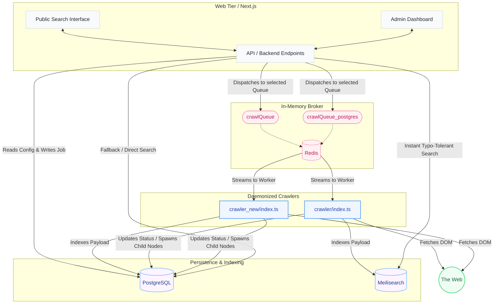

# FocusEngine Architecture

## Overview
FocusEngine is a highly modular, decoupled search engine and crawler system. It operates on a split-tier architecture isolating user-facing web requests from heavyweight, unpredictable background crawling operations. This decoupled approach allows for infinite horizontal scalability across heterogeneous storage and indexing paradigms.

## System Topology & Visual Flow



---

## Core Components Breakdown

### 1. Web Frontend (`/web`)
- **Framework**: Built on Next.js 14 (App Router) utilizing React Server Components dynamically alongside interactive client islands.
- **Search Controller**: Implements a debounced, real-time fetching loop that triggers the `/api/search` route every 300ms. Visual CSS state-changes mask latency ensuring perceived instant responses.
- **Admin Authentication**: Enforced globally by a strict Edge-compatible Middleware path matcher `['/admin', '/admin/:path*']`. All dashboard sub-routes reject tokens not explicitly cryptographically signed by the `$JWT_SECRET`.
- **Dispatcher Agent**: The Next.js API acts as the central BullMQ dispatcher. It reads the globally active `crawlerSelection` key from Postgres synchronously, registers a permanent Graph Node as `QUEUED`, and physically publishes the URL pointer to the respective Redis stream channel.

### 2. The Daemon Workers (`/crawler` & `/crawler_new`)
- **Framework**: Bare-metal Node.js executing TypeScript natively without compilation delays via `tsx`. Parses heavy DOM manipulation through `cheerio`.
- **Fault-Tolerant execution**: 
  1. Workers wrap network fetch requests in extremely strict 10,000ms `AbortControllers` to immediately drop hung server responses.
  2. Syntactic parse failures fall through local `catch` blocks which log directly back to Postgres under `errorLog`.
  3. Entire Node environments are blanketed by `uncaughtException` and `unhandledRejection` native listeners. Catastrophes (like absolute memory-leaks during massive DOM arrays) simply abort the specific event loop tick but deliberately keep the daemon process alive to pull the next Redis chunk.
- **Worker Concurrency**: Set rigidly to `concurrency: 5` to ensure steady resource draining without throttling local disk I/O.

---

## Indexing Data Structures & Algorithms

To ensure rapid and relevant search capability, FocusEngine applies a very specific algorithmic pipeline to raw HTML before injecting formulated records into databases.

### 1. Document Extraction Pipeline
When a crawler worker fetches a URL, it executes the following DOM refinement:
1. Validates the `content-type` header is explicitly `text/html`.
2. Locates the root document `<title>` or falls back to the leading `<h1>`.
3. Extracts standardized meta descriptions (`<meta name="description">` or OGP protocols).
4. Strips all visual noise DOM nodes structurally via RegEx replacements: `<script>`, `<style>`, `<noscript>`, `<iframe>`, `<link>`, `<meta>`, `<svg>`.
5. Condenses the entire `<body>` DOM text deeply into a single whitespace-trimmed string, intentionally limited to **5,000 characters** to rigidly cap Postgres row sizes and RAM allocations.

### 2. Algorithmic Keyword Generation
If a target page completely lacks `<meta name="keywords">`, FocusEngine dynamically synthesizes them utilizing a **Frequency-based Stop-Word elimination algorithm**:
- Converts the 5,000-character text body into an array of lowercase standard word tokens.
- Drops any word explicitly shorter than 5 characters long.
- Filters out common linguistic noise using a heavily predefined `Set` of English/JavaScript syntactic stop-words (e.g., "about", "against", "because", "through", "function", "document").
- Calculates keyword frequency mapping integers (`Record<string, number>`).
- Sorts the object array strictly by occurrence density and extracts the **top 10 most utilized thematic terms** to attach to the query payload.

### 3. Meilisearch Index Payload (JSON Schema)
The original Meilisearch crawler maps the condensed page into the exact following schema payload format:
```json
{
  "id": "aHR0cHM6Ly9leGFtcGxlLmNvbQ",  // Primary Key: base64url encoded URL (Alphanumeric safe for Meili validation)
  "url": "https://example.com/",       // Original URI web pointer
  "title": "Example Domain",           // Extracted Title
  "description": "This domain...",     // Extracted Meta Description
  "keywords": "domain, examples, ...", // Top 10 algorithm-derived thematic keywords
  "textContent": "This domain is...",  // Raw indexed block (up to 5k chars)
  "indexedAt": "2026-03-21T15:30:00Z"  // ISO-8601 UTC creation timestamp
}
```
*Note: The engine natively instructs the Meilisearch cluster to map its searchable attributes internally exclusively to `['title', 'description', 'keywords', 'textContent']` to prioritize ranking calculations across contextual fields.*

---

## Core Relational Data Structures (Prisma Schema)

The PostgreSQL database acts as the strict source of truth for global configuration, relational crawling traversal tracking, and static document ingestion.

### `CrawlJob` (Graph Nodes)
Manages the distributed traversal state of external URLs. Implements a direct **Self-Referencing** relationship structure (`parentId` -> `id`) to natively construct acyclic crawl tree graphs.
```prisma
model CrawlJob {
  id          String     @id @default(uuid())
  url         String
  depth       Int        @default(0)         // Distance remaining from tree origin
  status      String     @default("QUEUED")  // Validates explicit sequence states
  errorLog    String?                        // Catch handlers push tracebacks here
  rootUrl     String?                        // The distinct website domain tree entrypoint
  parentId    String?                        
  parent      CrawlJob?  @relation("JobTree", fields: [parentId], references: [id])
  children    CrawlJob[] @relation("JobTree") // Maps entire descendant tree branches deeply
  createdAt   DateTime   @default(now())
  updatedAt   DateTime   @updatedAt
}
```

### `Document` (Node Payloads)
The static storage table utilized exclusively by the `crawler_new` instance to store scraped web payloads entirely on-premise without secondary engine API latency.
```prisma
model Document {
  id          String   @id        // Enforces unique collision handling via base64 encoded URL
  url         String   @unique
  title       String
  description String
  keywords    String              // Derived text token string
  textContent String              // Raw unparsed text chunk
  indexedAt   DateTime @default(now())
}
```

### `Setting` (Runtime Context)
Global atomic flags loaded dynamically by the Next.js runtime upon initial routing invocations (intercepts defaults like `crawlerSelection`).
```prisma
model Setting {
  id    String @id @default(uuid())
  key   String @unique
  value String
}
```
